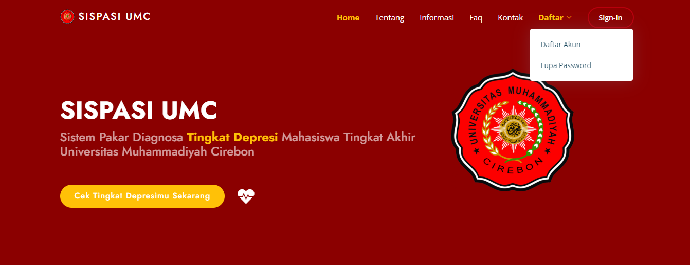
# SISPASI UMC 2023

## Apa itu Sispasi UMC?

Sispasi UMC adalah sistem pakar untuk mendiagnosis tingkat depresi pada mahasiswa tingkat akhir dengan menggunakan metode *certainty factor. Untuk link demo silahkan klik [Demo Aplikasi](https://sispasi.mosyahizuku.site/). Demo app tersebut mungkin akan membutuhkan waktu yang agak lama saat dibuka karena menggunakan hosting gratis, dan fitur login with google tidak di masukkan kedalam demo tersebut dikarenakan library google client terlalu besar sehingga storage hosting tidak cukup.

#### NOT FREE :)
* Copyright 2023 Mosyahizuku.
* Contact Person [Website Mosyahizuku](https://mosyahizuku.site) Or [Whatsapp](https://wa.me/628988658838)
* [Link Demo Aplikasi](https://sispasi.mosyahizuku.site/)

## Framework dan Library yang digunakan
- [Codeigniter 4](https://codeigniter.com/)
- [Bootstrap 5](https://getbootstrap.com/)
- [Template Dashboard by SB-Admin](https://startbootstrap.com/theme/sb-admin-2)
- [Template Landing by Arsha](https://bootstrapmade.com/arsha-free-bootstrap-html-template-corporate/)
- PHPMailer
- Google Client
- DOMPdf
- PHPOffice

## Fitur 
### Halaman Utama
- Landing Page
- Halaman Tentang, Informasi, FAQ dan Kontak
- Halaman Kritik Dan Saran (Pemberitahuan dan ucapan terima kasih Akan terkirim melalu Email)

### Halaman Cek Diagnosa
- Homepage Cek Diagnosa              
- Form Biodata
- Form Pertanyaa Internal (Pribadi)
- Form Gejala
- Panduan pemakaian

### Halaman Hasil Diagnosa
- Homepage Hasil Diagnosa              
- Tampil jumlah gejala terpilih dan tak terpilih
- Tampil Nilai CF Akhir terbesar dan Persentase
- Tampil jawaban mengenai pertanyaan personal (Pribadi)
- Tampil perbandingan persentase dengan penyakit lain
- Tampil detail perhitungan
- Tampil deskripsi depresi dan solusi penanganan
- Unduh hasil diagnosis (PDF)

### Login User
- Memakai Email dan Password (Enskripsi)
- Register (Akan dapat Email OTP)
- Lupa Password (Akan dapat Email Token)
- Login With Google (OAuth2)

### Login Admin
- Memakai Username dan Password

### Dashboard Admin
- Data Gejala, Penyakit, dan FAQ (Crud)
- Data Aturan/Rule (Untuk setting nilai pakar)
  * Setting nilai MB dan MD
  * nilai CF pakar otomatis keluar saat nilai MB dan MD dimasukkan
- Data laporan diagnosa
  * Fitur Truncate Data
  * Fitur Unduh PDF
  * Fitur Unduh Excel
  * Fitur Cetak Langsung
  * View data individu
  * Unduh PDF (Individu)
- Data Admin & User
- Data OTP & Token Reset Password

## Dokumentasi Project
### Halaman Diagnosa
| Form Login | Login Success |
| -------------- | -------------- |
| 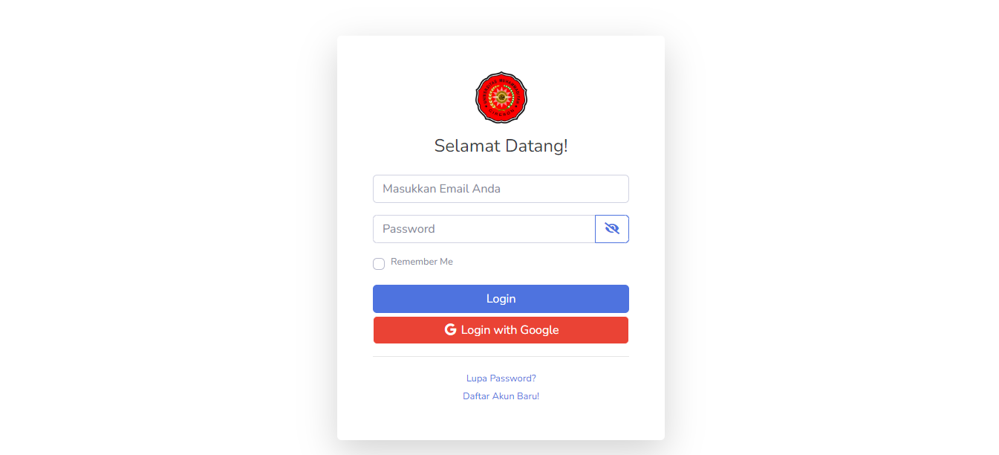 | 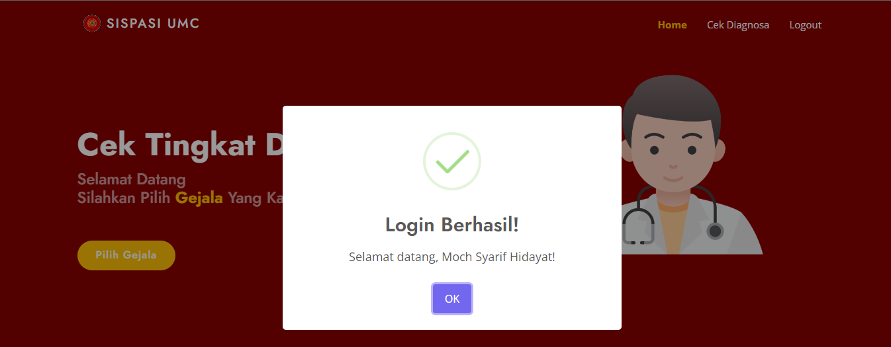 |
| Form Biodata | Form Pertanyaan |
| 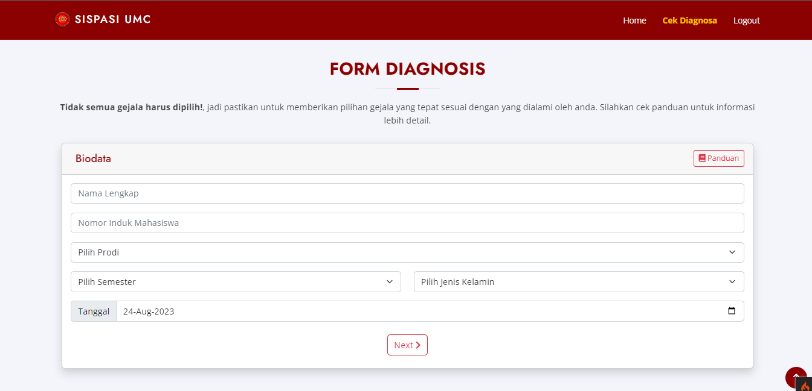 | 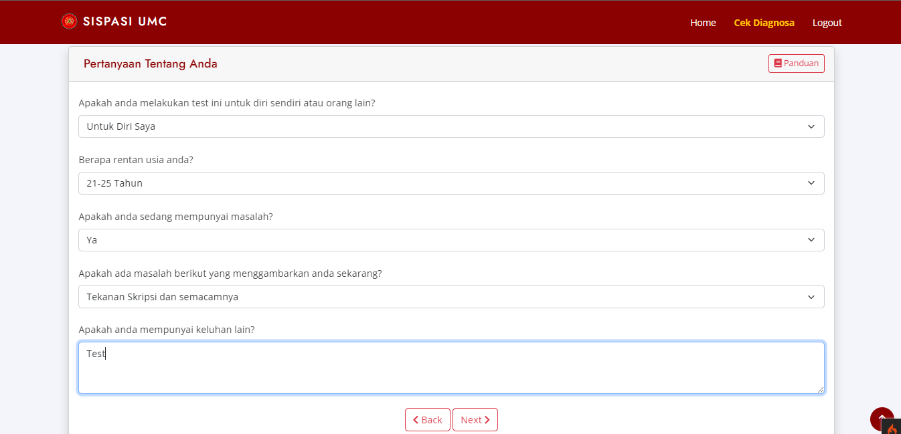 |
| Form Pilih Gejala | Hasil Diagnosa (1) |
| 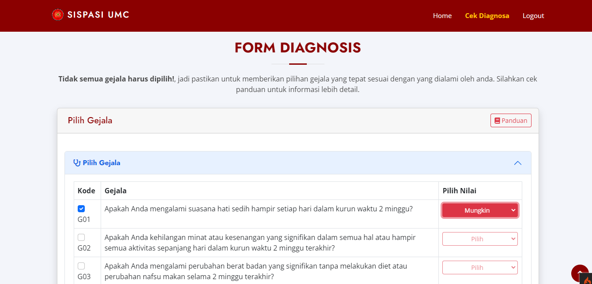 | 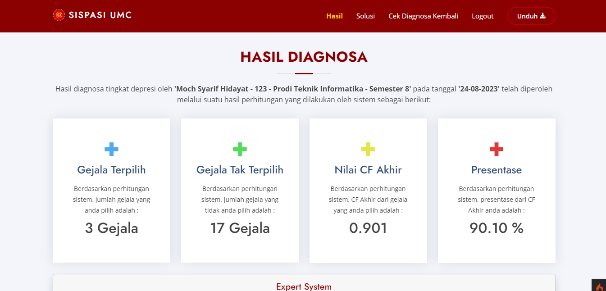 |
| Hasil Diagnosa (2) | Hasil Diagnosa (3) |
| 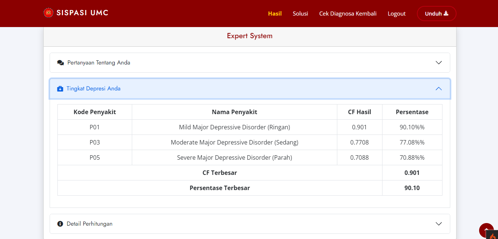 | 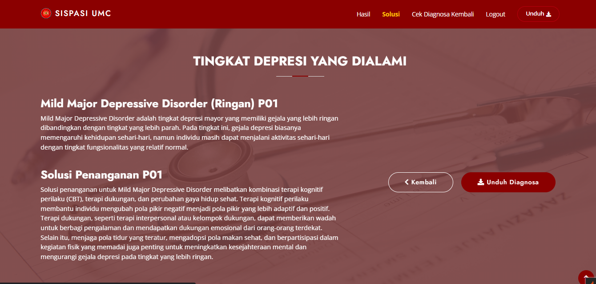 |

### Halaman Dashboard
| Dashboard 1 | Data Aturan/Rule |
| -------------- | -------------- |
| 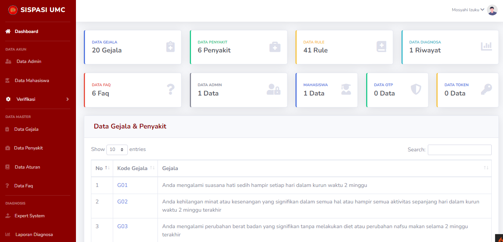 | 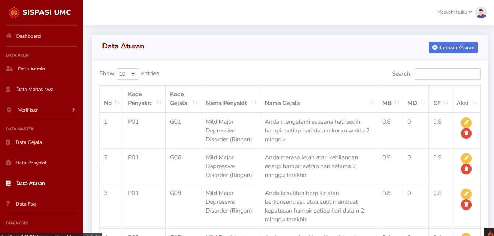 |
| Laporan Diagnosa All | Laporan Diagnosa Individu |
| 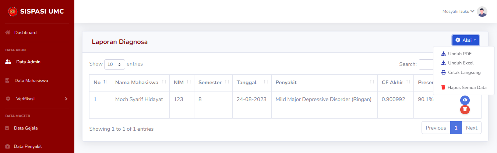 |  |


## Run Project
### Persyaratan
- [Composer](https://getcomposer.org/)
- [XAMPP](https://www.apachefriends.org/download.html) atau sejenisnya dengan versi php 7.4++ dengan mengaktifkan ``intl`` pada ``xampp\config\php.ini`` hapus tanda `` ; ``

### Instalasi Project
- Unduh dan import project ini ke dalam direktori proyek anda (htdocs).
- konfigurasi file ``env example`` menjadi ``.env`` lalu ubah nama database, username dan password (jika ada)
- Ubah url yang terletak pada ``app/config/App.php`` lalu ubah bagian ``public string $baseURL`` sesuai dengan alamat project anda.
- Penting!! Install dependencies yang diperlukan dengan cara menjalankan perintah berikut di terminal:
```code
composer install
```
- buat database pada phpmyadmin anda ``http://localhost:phpmyadmin`` , sesuaikan nama db tersebut dengan nama db yang tertera pada ``.env``
- Jalankan migration database pada terminal anda:
```code
php spark migrate --all
```
- Jika anda ingin menggunakan data rujukan diagnosis dari sistem ini, silahkan pakai seeder yang tersedia:
```code
php spark db:seed --all
```
- Jika sudah silahkan buka web serve dengan alamat url yang sudah anda tentukan sebelumnya.
- Data login admin dapat dilihat di ``app/Database/Seeds/AdminSeeder``

### Hal Yang Perlu Diperhatikan
Jika anda ingin mengaktifkan *Login With Google* anda wajib melakukan konfigurasi terhadap email yang akan anda gunakan
- pertama, anda harus mempunyai ``Client ID`` dan ``Client Secret`` yang didapat dari [Developers Console](https://console.developers.google.com), anda bisa mencari caranya di youtube/google dll.
- kedua, pada bagian redirect URI [Developers Console](https://console.developers.google.com) anda wajib menyertakan ``login-google/callback`` pada bagian akhir url. contoh ``http:\\sispasi-umc.com\login-google\callback``
- ketiga, jika anda sudah mempunyai keduanya, anda buka ``app/Config/Controllers/Auth.php`` dan ubah bagian ini:
```code
private function initializeGoogleClient()
    {
        $client = new Google_Client();
        $client->setClientId('Masukkan Client ID Disini');
        $client->setClientSecret('Masukkan Client Secret Disini');
        $client->setRedirectUri(base_url('login-google/callback'));
        $client->addScope('email');
        $client->addScope('profile');
        return $client;
    }
```
- jika anda melakukan semua itu dengan benar, maka login with google akan bisa digunakan tanpa kendala.

Jika anda ingin mengaktifkan *Send Email OTP - Kritik dan Saran Email - Token Lupa Password* anda wajib melakukan konfigurasi terhadap email yang akan anda gunakan juga
- pertama, anda harus mengkonfigurasi authenticated 2 langkah pada email yang ingin anda gunakan sebagai send OTP email dll
- kedua, jika sudah maka anda akan diberikan password dalam bentuk acak yang nantinya kita gunakan.
- ketiga, jika anda ingin mengkonfigurasi *Send OTP Email* maka anda buka ``app/Config/Controllers/RegisterController`` dan ubah bagian:
```code
        $mail = new PHPMailer();
        $mail->isSMTP();
        $mail->Host = 'smtp.gmail.com';
        $mail->SMTPAuth = true;
        $mail->Username = 'MASUKKAN EMAIL ANDA DISINI';
        $mail->Password = 'MASUKKAN PASSWORD AUTHENTICATED 2 LANGKAH DISINI';
        $mail->SMTPSecure = 'tls';
        $mail->Port = 587;

        // Recipients
        $mail->setFrom('MASUKKAN EMAIL ANDA DISINI', 'Sispasi UMC');
        $mail->addAddress($email);
```
- Jika anda ingin mengkonfigurasi *Kritik dan Saran Email* maka anda buka ``app/Config/Controllers/KritikController``, dan *Send Token Reset Password* buka ``app/Config/Controllers/ResetPasswordController`` (ubah bagian seperti Send OTP Email).

## Kesimpulan
Dengan adanya aplikasi sistem pakar diagnosis tingkat depresi ini diharapkan dapat membantu penanganan yang tepat terhadap teman-teman mahasiswa yang sedang mengalami depresi.

Jangan lupa star yaa.....

## License
Copyright © 2023 Mosyahi-Dev.
* cp [Mosyahizuku](https://mosyahizuku.site) Or [Whatsapp](https://wa.me/628988658838)
* [Link Demo Aplikasi](https://sispasi.mosyahizuku.site/)

## Authors
[Mosyahi-Dev](https://instagram.com/mochsyarifhidayat13)


